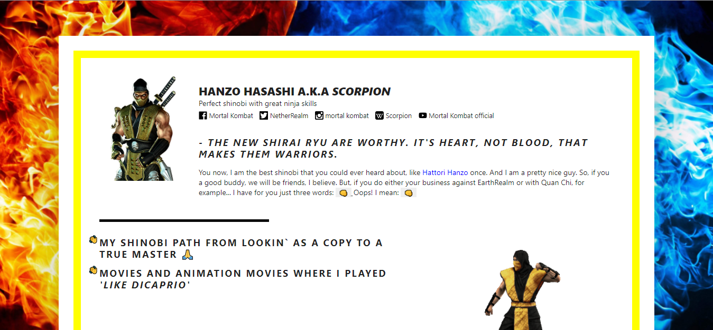
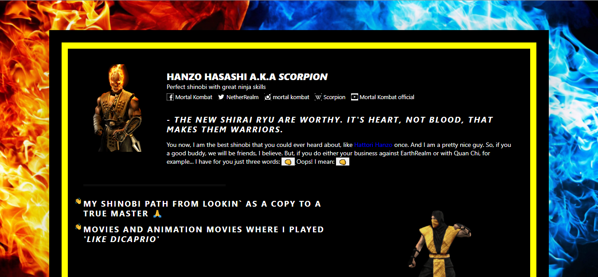

# homepage_scorpion

This website is a résumé of most popular and dangerous fighter that you can ever imagine
GET OVER HERE! :feelsgood:

# Preview

####Light mode:

####...And dark mode:

# Links

1. [gh-pages](https://faustthefirst.github.io/homepage_scorpion);
2. [AWS staging](http://bsawa-staging.s3-website.eu-north-1.amazonaws.com);
3. [AWS production](http://bsawa-production.s3-website.eu-north-1.amazonaws.com);
4. [Versel](https://homepage-scorpion.vercel.app/)

# Credits

1. This site is based on Mr. Kushnir`s repositoty
2. Content for the site is taken from Fandom Wiki
3. NetherRealm Studios, NetherRealm Studios logo, Mortal Kombat, and all related characters and elements are ™ & Warner Bros. Entertainment Inc.
4. WB SHIELD ™ & Warner Bros. Entertainment Inc.(s10)
5. Icons made by Freepik from www.flaticon.com
6. Radio button is made according to Online tutorials
7. Made for educational purposes to Binary Studio Academy
8. Developed by Bohdan Panashenko, 2021
